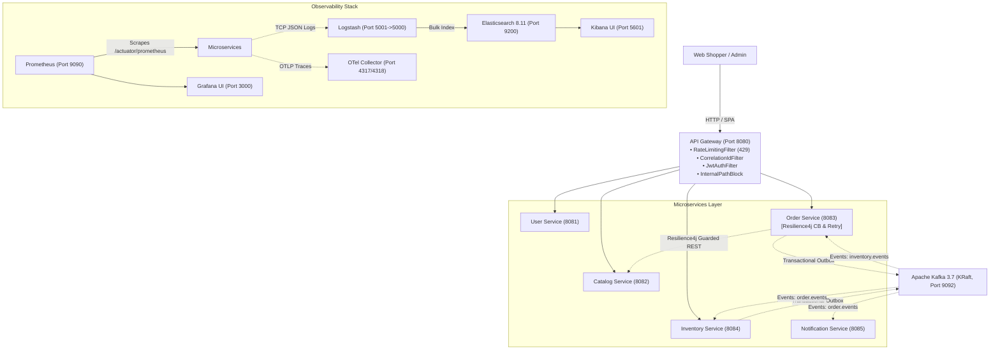

# 🐾 Paws & Claws — Pet Store E-Commerce Platform (V4 Production-Grade Architecture)

A production-grade, distributed microservices e-commerce platform for pet food and accessories (supporting **Dogs** and **Cats**). Features a customer-facing storefront, a dedicated administrative management portal, an intelligent API Gateway, independent Spring Boot microservices backed by database-per-service PostgreSQL databases, an **event-driven architecture powered by Apache Kafka (KRaft mode)** with **Transactional Outbox**, and full **Production-Grade Observability & Resilience (ELK, OpenTelemetry, Prometheus, Grafana, Resilience4j, Rate Limiting)**.

---

## 📑 Table of Contents

- [V4 Observability & Resilience Highlights](#-v4-observability--resilience-highlights)
- [System Architecture Diagram](#-system-architecture-diagram)
- [Services & Port Directory](#-services--port-directory)
- [Observability & Monitoring Infrastructure](#-observability--monitoring-infrastructure)
  - [Centralized Logging (ELK Stack)](#centralized-logging-elk-stack)
  - [Distributed Tracing (OpenTelemetry)](#distributed-tracing-opentelemetry)
  - [Prometheus Metrics & Micrometer](#prometheus-metrics--micrometer)
  - [Grafana Pre-Provisioned Dashboards](#grafana-pre-provisioned-dashboards)
- [Resilience & Fault Tolerance](#-resilience--fault-tolerance)
  - [Resilience4j Circuit Breakers & Retries](#resilience4j-circuit-breakers--retries)
  - [API Gateway Rate Limiting](#api-gateway-rate-limiting)
  - [Graceful Shutdown & Health Probes](#graceful-shutdown--health-probes)
- [Event Choreography & Kafka Architecture](#-event-choreography--kafka-architecture)
- [Quick Start: Running with Docker Compose](#-quick-start-running-with-docker-compose)
- [Default Credentials & Access Links](#-default-credentials--access-links)
- [Interactive API Docs (Swagger / OpenAPI 3)](#-interactive-api-docs-swagger--openapi-3)
- [Verification & Automated Tests](#-verification--automated-tests)

---

## 🌟 V4 Observability & Resilience Highlights

V4 brings true enterprise, production-ready observability and fault tolerance to the Pet Store microservices platform:

1. **Centralized Logging (ELK Stack)**:
   - All 6 backend services stream structured JSON log events over non-blocking TCP socket (`LogstashTcpSocketAppender`) to **Logstash** on port `5000`.
   - Logstash enriches and routes logs into **Elasticsearch 8.11.3** (`petstore-logs-%{+YYYY.MM.dd}`).
   - **Kibana 8.11.3** pre-configured with the `petstore-logs-*` Data View for instant discovery and correlation.
   - Unified log format outputting `[service, traceId, spanId, correlationId, level, message, logger, thread, stackTrace]`.

2. **Distributed Tracing (OpenTelemetry)**:
   - End-to-end W3C Trace Context (`traceparent`) propagation across HTTP gateway calls, inter-service calls, and Kafka event record headers.
   - Backed by **Micrometer Tracing**, **OpenTelemetry Bridge**, and native Spring Kafka Observation.
   - **OpenTelemetry Collector Contrib** receiving OTLP traces on gRPC (`4317`) and HTTP (`4318`) with batch processing.

3. **Metrics & Prometheus Scrapes**:
   - Every service exposes `/actuator/prometheus` scraping endpoints with standard JVM, CPU, memory, HikariCP database pool, and Spring HTTP metrics.
   - Custom business metrics: `orders_created_total`, `orders_confirmed_total`, `orders_cancelled_total`, `outbox_pending_count`, `outbox_published_total`, `inventory_stock_reserved_total`, `inventory_stock_reservation_failed_total`, `notifications_processed_total`, `dlt_messages_total`, and `rate_limit_exceeded_total`.
   - Prometheus server actively scraping all 6 microservices at 5s intervals.

4. **Grafana Dashboards (Pre-provisioned & Automated)**:
   - **Pet Store - Application Overview (`petstore-overview`)**: Service UP statuses, HTTP req/s, 5xx error rate, P95 latency, rate-limiting drops.
   - **Pet Store - JVM & System Performance (`petstore-jvm`)**: Heap memory, CPU usage, GC activity, thread counts, Hikari connection pool saturation.
   - **Pet Store - Kafka Observability & DLT (`petstore-kafka`)**: Producer/consumer message rates, Dead Letter Topic (DLT) counts, notification throughput.
   - **Pet Store - Business Metrics & Outbox Pattern (`petstore-business`)**: Outbox backlog gauge, order state transitions, stock reservation success vs. failures.

5. **Resilience4j Fault Tolerance**:
   - `ProductCatalogClient` in `order-service` guarded with `@CircuitBreaker`, `@Retry` with exponential backoff, `@Bulkhead`, and connect/read timeouts.
   - Graceful fallback handlers prevent cascading failures if catalog-service is under load or down.

6. **API Gateway In-Memory Rate Limiting**:
   - Token Bucket rate limiter on Spring Cloud Gateway protecting sensitive endpoints (`/api/auth/**`, `/api/orders/**`, `/api/products/**`).
   - Returns HTTP `429 Too Many Requests` with `Retry-After: 30` header and records Prometheus metric `rate_limit_exceeded_total`.

---

## 🏛️ System Architecture Diagram



---

## 🧭 Services & Port Directory

| Container / Service | Port (Host:Container) | Description / Role | Health / Status |
| :--- | :--- | :--- | :--- |
| **`petstore-customer-frontend`** | `5173:80` | Customer Web Storefront (React + TypeScript + Vite) | Running |
| **`petstore-admin-frontend`** | `5174:80` | Admin Operations Portal (React + TypeScript + Vite) | Running |
| **`petstore-api-gateway`** | `8080:8080` | API Gateway + Rate Limiting + Correlation ID | Healthy |
| **`petstore-user-service`** | `8081:8081` | Authentication, JWT, Users & Address Books | Healthy |
| **`petstore-catalog-service`** | `8082:8082` | Products, Categories, Stock Query | Healthy |
| **`petstore-order-service`** | `8083:8083` | Carts, Orders, Outbox Publisher, Resilience4j | Healthy |
| **`petstore-inventory-service`**| `8084:8084` | Stock Reservations, Inventory Outbox, Stock Audits | Healthy |
| **`petstore-notification-service`**| `8085:8085` | Kafka Consumer & Notifications, DLT Handler | Healthy |
| **`petstore-postgres`** | `5432:5432` | PostgreSQL 16 (Isolated DB per service) | Healthy |
| **`petstore-kafka`** | `9092:9092` | Apache Kafka 3.7.0 (KRaft Mode) | Healthy |
| **`petstore-cloudbeaver`** | `8978:8978` | Database Management Web Console | Running |
| **`petstore-elasticsearch`** | `9200:9200` | Elasticsearch 8.11.3 (Log search & storage) | Healthy |
| **`petstore-logstash`** | `5001:5000` | Logstash 8.11.3 (TCP JSON ingestion pipeline) | Running |
| **`petstore-kibana`** | `5601:5601` | Kibana 8.11.3 (Log visualization & search) | Running |
| **`petstore-otel-collector`** | `4317, 4318` | OpenTelemetry Collector (OTLP gRPC & HTTP) | Running |
| **`petstore-prometheus`** | `9090:9090` | Prometheus 2.51.0 (Scrapes metrics at 5s interval)| Running |
| **`petstore-grafana`** | `3000:3000` | Grafana 10.4.0 (Pre-provisioned dashboards) | Running |

---

## 🔍 Observability & Monitoring Infrastructure

### Centralized Logging (ELK Stack)
- Access Kibana: **[http://localhost:5601](http://localhost:5601)**
- Navigate to **Analytics &rarr; Discover** & select the pre-created **`petstore-logs-*`** data view.
- Filter by `service`, `correlationId`, `traceId`, `spanId`, or `level`.

### Distributed Tracing (OpenTelemetry)
- Every microservice exports traces to `http://otel-collector:4318/v1/traces`.
- Incoming HTTP requests and Kafka event messages propagate `traceparent` and correlation headers across boundaries.

### Prometheus Metrics & Micrometer
- Prometheus Web UI: **[http://localhost:9090](http://localhost:9090)**
- View target scrape health: **[http://localhost:9090/targets](http://localhost:9090/targets)**
- Core business metrics available:
  - `orders_created_total`
  - `orders_confirmed_total`
  - `orders_cancelled_total`
  - `outbox_pending_count`
  - `outbox_published_total`
  - `inventory_stock_reserved_total`
  - `rate_limit_exceeded_total`

### Grafana Pre-Provisioned Dashboards
- Access Grafana: **[http://localhost:3000](http://localhost:3000)** (Credentials: `admin` / `admin`)
- Dashboards are pre-loaded under the **PetStore** folder:
  1. **Pet Store - Application Overview**: Real-time traffic, error rates, P95 latency.
  2. **Pet Store - JVM & System Performance**: Heap, non-heap, CPU, GC pause times, HikariCP database pool.
  3. **Pet Store - Kafka Observability & DLT**: Consumer lag, throughput, DLT message alarms.
  4. **Pet Store - Business Metrics & Outbox Pattern**: Order volume, inventory reservations, outbox processing rates.

---

## 🛡️ Resilience & Fault Tolerance

### Resilience4j Circuit Breakers & Retries
Configured on `order-service` when communicating with `catalog-service`:
- **Circuit Breaker**: Sliding window of 10 calls, trips at 50% failure rate, wait duration 5s in OPEN state.
- **Retry**: Up to 3 attempts with exponential backoff (multiplier 2x, initial 500ms).
- **Bulkhead**: Maximum 10 concurrent requests with 100ms max wait.
- **Timeouts**: Socket connect timeout (3s) and read timeout (5s).

### API Gateway Rate Limiting
In-memory Token Bucket rate limiter protecting public endpoints:
- Auth routes (`/api/auth/**`): Burst capacity 5, refill rate 1.0/sec.
- Orders (`/api/orders/**`): Burst capacity 20, refill rate 5.0/sec.
- Products (`/api/products/**`): Burst capacity 50, refill rate 15.0/sec.
- When tripped, returns HTTP `429 Too Many Requests` with header `Retry-After: 30`.

---

## 🚀 Quick Start: Running with Docker Compose

### Prerequisites
- Docker Engine 20+ & Docker Compose v2+

### 1. Launch the Full Stack
```bash
docker compose up -d --build
```

### 2. Verify Running Containers
```bash
docker compose ps
```
All 17 containers will report `healthy` or `running`.

---

## 🔑 Default Credentials & Access Links

| Application / UI | URL | Credentials |
| :--- | :--- | :--- |
| **Customer Storefront** | [http://localhost:5173](http://localhost:5173) | Register any customer account |
| **Admin Portal** | [http://localhost:5174](http://localhost:5174) | `admin@petstore.com` / `Admin@123` |
| **Grafana Dashboards** | [http://localhost:3000](http://localhost:3000) | `admin` / `admin` |
| **Kibana Logs** | [http://localhost:5601](http://localhost:5601) | No auth required (local dev mode) |
| **Prometheus Metrics** | [http://localhost:9090](http://localhost:9090) | No auth required |
| **CloudBeaver DB Admin** | [http://localhost:8978](http://localhost:8978) | Configurable on first launch |

---

## 📖 Interactive API Docs (Swagger / OpenAPI 3)

- **API Gateway**: `http://localhost:8080/swagger-ui.html`
- **User Service**: `http://localhost:8081/swagger-ui/index.html`
- **Catalog Service**: `http://localhost:8082/swagger-ui/index.html`
- **Order Service**: `http://localhost:8083/swagger-ui/index.html`
- **Inventory Service**: `http://localhost:8084/swagger-ui/index.html`

---

## 🧪 Verification & Automated Tests

Run the complete end-to-end V4 observability test suite:

```bash
python3 scratch/test_v4_observability.py
```

Expected output:
```text
================== SUMMARY ==================
1. Service Health & Probes: PASS
2. Prometheus Scrapes:      PASS
3. E2E Order & Outbox Flow: PASS
4. Elasticsearch Logs:      PASS
5. Gateway Rate Limiting:   PASS
6. Grafana Dashboards:      PASS
```
